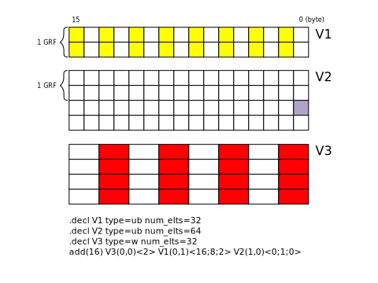
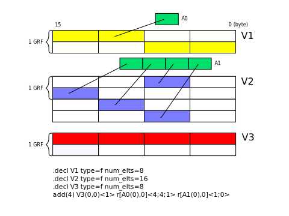

<!---======================= begin_copyright_notice ============================

Copyright (C) 2020-2022 Intel Corporation

SPDX-License-Identifier: MIT

============================= end_copyright_notice ==========================-->

# Operands

There are two types of operands: **vector** and **raw**. Vector operands
represent vector data values used in SIMD instructions and may include
offset and region information. Raw operands are used to represent the
destination and source of memory access and sample instructions, which
must be accessed contiguously and do not support 2D element access.

Region-based Addressing
=======================

Virtual ISA supports a region-based addressing scheme for general
variables. In a Virtual ISA instruction, a general operand or an
indirect operand defines a region describing the data elements that will
be accessed from a general variable. For source operands, regions are
generalized 2D arrays in row-major order, where each row is the size of
a GRF register. Specifically, a source region takes the following
format:

**VN(R,C) &lt; VertStride; Width, HorzStride&gt;**

-   **Region origin (VN(R,C))**: This parameter determines the location
    of the first data element accessed from VN. Both R, the row offset,
    and C, the column offset, must be immediate constants.
-   **Width**: This parameter specifies the number of data elements of a
    row.
-   **HorzStride**: This parameter specifies the step size between two
    adjacent data elements in a row.
-   **VertStride**: This parameter specifies the step size between two
    rows.

Width, HorzStride, and VertStide are all in the unit of data element
size. Together with the instruction's execution size (ExecSize), the
following pseudo-code may be used to derive the data elements accessed
by a source operand:

```
    SourceDataElements[ExecSize];
    int count = 0;
    FirstElementIndex = R * (GRF_Size_in_Bytes / sizeof(VN_type)) + C;
    for( int i = 0; i < ExecSize / Width; i++) {
      for( int j = 0; j < Width; j++ ) {
        SourceDataElements[count++] = VN[FirstElementIndex + i * VertStride + j * HorzStride];
      }
    }
```

Region for a destination operand, on the other hand, is only 1D, and it
takes the following format:

**VN(R,C) &lt;HorzStride&gt;**

```
    DstDataElements[ExecSize];
    FirstElementIndex = R * (GRF_Size_in_Bytes / sizeof(VN_type)) + C;
    for (int i = 0; i < ExecSize; i++ ) {
      DstDataElements[i] = VN[FirstElementIndex + i *HorzStride];
    }
```

The behavior is undefined if an operand attempts to access an
out-of-bound data element. The figure below illustrates the use of
regions for general operands.



Region Interpretation for Indirect Operands
-------------------------------------------

For indirect operands, two regioning modes are supported:
**single-address** and **multi-address** (uses ExecSize/Width
addresses). A single-address indirect operand takes the following
format:

**r\[AN(k), offset\]&lt;VertStride; Width, HorzStride&gt; //source**

**r\[AN(k), offset\]&lt;HorzStride&gt; //destination**

The region parameters are interpreted identically to the general
operands, except that the region origin will be the data element at the
address AN(k) + offset. A multi-address indirect operand is specified by
a null vertical stride:

**r\[AN(k), offset\]&lt;; Width, HorzStride&gt; //source**

In this mode, the origin of each row is determined by the contents of
the address operand. The first element in the address operand provides
the origin of the first row, while successive contiguous address
elements provide the origin for the following rows. In the special case
where Width is equal to one, ExecSize number of address elements will be
used. Each address element is permitted to point to a different general
variable. The following pseudo-code may be used to derive the data
elements accessed by a multi-address indirect source operand:

```
    SourceDataElements[ExecSize];
    int count = 0;
    for( int i = 0; i < ExecSize / Width; i++) {
      RowStartOffset = AN(k + i) + offset;
      for( int j = 0; j < Width; j++ ) {
        SourceDataElements[count++] = *(RowStartOffset + j * HorzStride * sizeof(operand_type)];
      }
    }
```

The behavior is again undefined if an indirect operand attempts to
access an out-of-bound address or data element. The behavior is also
undefined if any of the address offset is not aligned to the type of the
indirect operand. The figure below illustrates the use of regions for
indirect operands.



Region Restrictions
-------------------

Regions provide a powerful mechanism for per-instruction data
gather/scatter, but the following rules must be observed:

**General Restrictions on Region Parameters**

1.  The legal values for Width are {1, 2, 4, 8, 16}.
2.  The legal values for VertStride are {0, 1, 2, 4, 8, 16, 32}.
3.  The legal values for HorzStride are {0, 1, 2, 4}.
4.  ExecSize must be greater than or equal to Width.
5.  HorzStride for a destination operand must not be 0.
6.  The elements accessed by an operand may not span more than two
    adjacent GRF registers.

**Implementation Note: To satisfy rule 6, the FE compiler must be aware
of the JIT compiler's variable alignment rules, which are as follows:**

-   Variables larger than or equal to one GRF in size will be
    GRF-aligned.
-   Variables less than one GRF will be placed in a single GRF (that is,
    it will not cross GRF-boundary).

**Additional Region Restrictions for indirect operands**

1.  Multi-address indirect operand may not be used as the destination of
    an instruction.

The behavior is undefined if any of the region rules are violated.

Predication
===========

Most vISA instructions are permitted to include a predicate control for
conditional SIMD channel selection for execution. The predication
control field consists of a single UW with the following binary format:

| Bit(s)   | Name                | Value                                                                |
| --- | --- | --- |
| 15       | Predicate Inverse   | "0" - no inverse                                                     |
|          |                     | "1" - use the inverse of each predicate bit                          |
| 13-14    | Predicate Combine   | "00" - sequential channel-to-predicate mapping                       |
|          |                     | "01" - any: returns 1 for all channels if any predicate bit is 1     |
|          |                     | "10" - all: returns 1 for all channels if all predicate bits are 1   |
|          |                     | "11" - reserved                                                      |
| 12       | Reserved            | Must be 0                                                            |
| 0-11     | Predicate ID        | Index of the predicate variable in range of [0-4095]                 |

If predicate combine and predicate inverse are both enabled, the
predicate combine will take effect first before the predicate inverse is
applied. The instruction's mask control determines the starting offset
for the predicate variable; e.g., a value of {M3} means the first
element will be pred_id(8). Together with the execution mask, the
predicate control determines the set of active channels for each
instruction with the algorithm below. Only channels whose channel enable
(ChEn) bit evaluates to true will have their output written to the
destination.

```
    EvaluateChEn() {  // evaluate the set of enabled Channels ChEn for this instruction
      // ChEn is a 32 bit mask
      // mask_control is one of {M1}, {M2}, ..., {M8}, and {NoMask}
          // pred_control is the controlling predicate operand
      if ( mask_control == NoMask ) {
        for ( n = 0; n < exec_size; n++ ) {
          ChEn[n] = 1;
          }
      }
      else {
        for ( n = 0; n < exec_size; n++ ) {
          ChEn[n] = EM[n + mask_control_offset] ? 1 : 0;
        }
      }
      if ( pred_control != 0 ) {
        // PMask is a 32 bit mask
        for ( n = 0; n < exec_size; n++ ) {
          PMask[n] = Pred[n + mask_control_offset];
        }
        if ( pred_control.any ) {
          PMask[0:exec_size-1] = (any of the PMask[0:exec_size-1] is 1) ? 1 : 0;
        }
        else if ( pred_control.all ) {
          PMask[0:exec_size-1] = (all of the PMask[0:exec_size-1] are 1) ? 1: 0;
        }
        if( pred_control.invert ) {
          PMask = ~PMask;
        }
        for ( n = 0; n < exec_size; n++ ) {
          ChEn[n] = ChEn[n] & PMask[n];
        }
      }
      for ( n = exec_size; n < 32; n++ ) {
        ChEn[n] = 0;
      }
```

For instructions that do not execute on the EU (e.g., memory access and
sampler instructions), the channel enable bit mask is evaluated and then
passed to the destination shared function to indicate which SIMD
channels were enabled. It is up to the shared function to interpret or
ignore the channel enable bits based on the functionality; for example,
scatter memory accesses typically will honor the channel enable by only
reading or writing to the enabled channels, while block memory accesses
generally ignore the channel enable and always perform the operation.
For details on the behavior of each instruction refer to their section.

Vector Operands
===============

Vector operands are used in arithmetic, logical, data movement, and
comparison instructions. These operands are typically general variables,
but may also be indirect accesses through an address variable. Address
operands may appear in the special address instructions. Most
instructions also may have a predicate operand to control conditional
execution.

A vector operand structure has different format depending on its operand
class:

```
    vec_operand {
      ub tag;
      ub info[];
    }
```

-   **<tag:**> This byte is common to all vector operands and contains
    two items: **operand_class** and **modifiers**.
    -   **operand_class (bit0-2):** A source operand may be one of the
        following:
        -   **General ("000"):** a general-purpose variable **v\#.**
        -   **Address ("001"):** an address variable **a\#**. Address
            variables may only appear in the special address
            instructions.
        -   **Predicate("010"):** a predicate variable **P**. Predicates
            may appear either in comparison, logical, or the special
            SETP instructions.
        -   **Indirect ("011"):** indirect access to a general-purpose
            variable through an address variable **(\[a\#\]).** The
            value of an indirect operand must be elements within one
            base General variable (in other words, address arithmetic
            must not cross variable boundary). In general, indirect
            operands may appear anywhere a General operand is used.
        -   **Immediate ("101"):** an immediate constant **.** An
            immediate constant may only be used as source operand.
        -   **State ("110"):** a state variable (one of
            sampler/surface). Its usage is restricted to the ADDR_ADD
            and MOVS instruction.
        -   The remaining values are reserved.
-   **modifiers (bit3-5):** modifiers that can be applied on the operand
    values. Valid values are:

Modifiers may only be used for General and Indirect operands; for the
other operands the modifier must be zero. The "not" modifier may only
appear in certain logic instructions (namely and, not, or, and xor),
while the arithmetic modifiers may appear in arithmetic, shift, and
move instructions.

-   **<info>** The format of the info array varies depending on the
    value of the operand_class.

General Operands
----------------

```
    gen_opnd { //operand_class = General
      ud id;
      ub row_offset;
      ub col_offset;
      uw region;
    }
```

-   **id:** index of the variable in the **variables** table.
-   **row_offset:** the offset, in number of rows, from the base of
    variable id. The size of a row is 32 bytes, the size of a GRF.
-   **col_offset:** the offset, in number of columns, from the base
    of variable id. The column offset may not cross the GRF boundary.
-   **region:** A region, together with the instruction's execution
    size, describes how the elements in a variable are accessed by an
    instruction. Two bytes are used to store the three region
    parameters: **vertical_stride, width, and horizontal_stride**.
    -   **vertical_stride (bit 0-3):** the step size between two
        rows, in units of data elements.
    -   **width (bit 4-7):** the number of data elements in a row.
    -   **horizontal_stride (bit 8-11):** the step size between two
        adjacent data elements within a row, in units of data
        elements.

The three items share a common binary encoding:

| Binary Encoding   | Value         |
| --- | --- |
| 0000              | Null          |
| 0001              | 0 element     |
| 0010              | 1 elements    |
| 0011              | 2 elements    |
| 0100              | 4 elements    |
| 0101              | 8 elements    |
| 0110              | 16 elements   |
| 0111              | 32 elements   |

Address Operands
----------------

```
    addr_opnd { //operand_class = Address
      uw id;
      ub offset;
      ub width;
      }
```

-   **id:** index of the variable in the **addresses** table.
-   **offset:** the offset, in number of elements, from the base of
    address variable id.
-   **width:** the number of data elements used. The legal values are
    the same of those for execution size, except that 32 is not allowed.

Address operands do not support regions and instead have a single offset
and width field. When used in an instruction, successive elements in the
address variable are accessed starting from a\#.&lt;offset&gt; up to a
total number of &lt;width&gt; elements. The sum of operand offset and
width must therefore be less than the size of the address variable. If
the instruction's execution size exceeds the operand width, the same
elements are replicated for the remaining channels. When used as the
destination, an address operand's width is ignored.

Predicate Operands
------------------

```
    pred_opnd { //operand_class = Predicate
      uw val;
    }
```

-   **val:** Value of the predicate id, control, and inverse (see Table
    8).

A predicate operand may appear as the direct source and destination of
logic instructions. The predicate operand supports neither offsets nor
regions; instead, contiguous elements are accessed starting from the
offset specified by the instruction's mask control.

Indirect Operands
-----------------

```
    indirect_opnd { //operand_class = Indirect
      uw id;
      ub addr_offset;
      w indirect_offset;
      ub bit_properties;
      uw region;
    }
```

-   **id:** index of the variable in the **addresses** table.
-   **addr_offset:** the offset, in number of elements, applied on the
    address variable before the indirect access.
-   **indirect_offset:** the byte offset applied on the general
    variable after the indirect access. It has the range of \[-512,
    511\].
-   **bit_properties**:
    -   type (bit 0-3): specifies the type of the indirect operand. An
        indirect operand may have any type except for V, UV, VF, and
        BOOL. The behavior is undefined if the address being accessed in
        any lane is not aligned to the specified type.
-   **region:** has the same layout as that in **gen_opnd**. A null
    vertical stride value ("0000") indicates a multi-address indirect
    operand.

Immediate Operands
------------------

```
    const_opnd { //operand_class = Immediate
      ub type;
      ud low;
      ud high; //present only for DF, Q, and UQ type
    }
```

-   **type:** bit0-3 specifies the type of the immediate constant. An
    immediate constant may have any type except BOOL.
-   **low:** the low 32-bit representation of the immediate constant's
    value.
-   **high:** the high 32-bit representation of the constant's value. It
    is present only for DF, Q, and UQ immediate constants.

Region and offset are not applicable to them. If an immediate operand
has one of the non-packed data types, the constant value is replicated
across all channels for the instruction. An immediate integer vector is
equivalent to an 8-element vector of type W (for type V) or UW (for type
UV) with zero offset and contiguous regions. An immediate float vector
(type VF) is equivalent to a 4-element float vector with zero offset and
contiguous regions.

State Operands
--------------

```
    state_opnd { //operand_class = State
      ub class;
      uw id;
      ub offset;
    }
```

-   **class:** bit 0-1 specifies the storage class of the underlying
    variable. Valid values are:
    -   "00": surface
    -   "01": sampler
-   **id:** index of the variable to the state_var table based on its
    storage class.
-   **offset:** the offset, in number of elements, from the base of
    address variable id.

Destination and source vector operands share the same common format
described above, with the following restrictions:

-   A constant operand is not allowed to be a destination.
-   A destination operand supports only 1D region, and its vertical
    stride and width for a destination operand are ignored.

Scalar Operands
---------------

When the vISA specification refers to a scalar operand, it can be one of
the following vector operands:

-   A general operand whose region is ignored, and only its first
    element is accessed, i.e., region is hard-coded to &lt;0;1,0&gt;
-   An indirect operand whose region is ignored, and only its first
    element is accessed, i.e., region is hard-coded to &lt;0;1,0&gt;
-   An immediate operand

Individual instructions may also impose more restrictions on the kind of
operands they take as sources and destinations.

The text format of a vector operand is specified in the vISA assembly
syntax appendix.

Raw Operands
============

Raw operands may appear as the destination or source of memory access
operations, and may only be a general variable. Unlike vector operands,
raw operands always refer to a contiguous register region and as such do
not support strided element accesses. Raw operands also do not support
the use of modifiers. Unless otherwise specified, all raw operands must
be GRF-aligned. The behavior is undefined if a raw operand attempts to
access an out-of-bound data element in the variable.

```
    raw_operand {
      ud id;
      uw offset;
    }
```

-   **id:** index of the variable in the variables table.
-   **offset**: the offset in bytes from the base of variable id.

In text format, a raw operand takes the following form:

**&lt;gen_var_name&gt;.&lt;offset&gt;**
